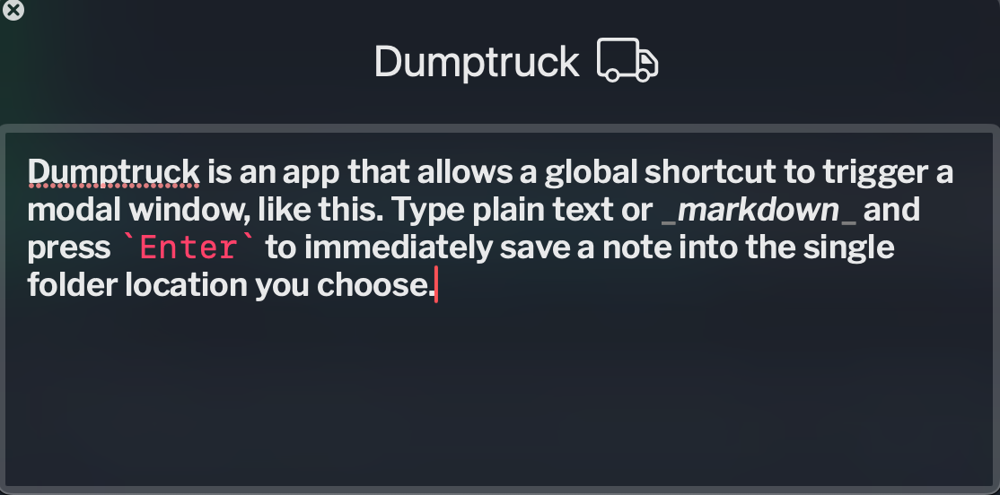

# Dumptruck 🚛

A native macOS menubar app for fast, Markdown-friendly text capture.



Press a global shortcut (default `⌘\`), type, hit **Return**, and your note is saved as a `.md` file in a folder of your choice. Markdown is syntax-highlighted as you type. Drafts persist between sessions so nothing is ever lost.

No Dock icon. No browser. No login. Just capture.

---

## Install

```bash
brew tap matchavez/dumptruck
brew install --cask dumptruck
```

Requires macOS 14 Sonoma or later.

> **First launch:** Because Dumptruck is not yet signed with a paid Apple Developer certificate, macOS will block it on the first open. Right-click the app → **Open** → confirm in the dialog. You only need to do this once.
>
> Alternatively, from Terminal:
> ```bash
> xattr -dr com.apple.quarantine /Applications/Dumptruck.app
> ```

---

## Settings

Open with `⌘,` from the right-click menu of the menubar icon, or from inside any Dumptruck window.

- **General** — save folder, filename template, save sound, launch at login, hide menubar icon, theme
- **Shortcut** — record a new global hotkey (default `⌘\`)
- **Editor** — font family and size
- **About** — version

## Keyboard

| Key | Action |
|---|---|
| `⌘\` (default) | Toggle capture window from anywhere |
| `Return` | Save and close |
| `Shift+Return` | Insert newline |
| `Esc` | Close without saving (draft is kept) |
| `⌘,` | Open Settings |
| `⌘Q` | Quit |

## Filename format

Default template: `{date}-{time}-{slug}` → `2026-05-26-1430-meeting-notes.md`

Slugging rules:

- First non-empty line of the note becomes the slug
- Markdown syntax (`# * - > _ \` [ ] ( )`) is stripped
- Punctuation (`? : , . ! ; " '`) is dropped
- Lowercased; whitespace → `-`
- Truncated to ~40 chars or 6 words, whichever comes first
- Collisions get `-2`, `-3`, … appended

## File locations

- **Notes**: wherever you chose in Settings → General
- **Drafts**: `~/Library/Application Support/Dumptruck/draft.md`
- **Settings**: `~/Library/Preferences/com.matchavez.Dumptruck.plist`

## Accessibility

- All controls have explicit VoiceOver labels.
- Reduce Motion is honored: the saved-confirmation flash is instant rather than animated when the system setting is on.
- Reduce Transparency replaces the HUD vibrancy with a solid material.
- The save confirmation uses a checkmark glyph + sound, never color alone.
- Editor font size is adjustable in Settings → Editor.

## Troubleshooting

**Global shortcut doesn't fire.** macOS may not have granted the app accessibility / input-monitoring permission. Open **System Settings → Privacy & Security → Accessibility** and add Dumptruck if it's not in the list.

**"Save folder isn't writable."** Pick a new folder in Settings → General. The default `~/Documents/Dumptruck` is usually fine; if it's missing, Dumptruck recreates it on launch.

**Menubar icon doesn't appear.** Check Settings → General → "Hide menubar icon (shortcut-only mode)" — uncheck it. The icon also won't appear if your menubar is full (long menubar + small display); detach a third-party menubar utility temporarily.

**Sound doesn't play.** Sound is on by default but respects system Do Not Disturb / Focus. To force-test, raise system volume and disable Focus, then save a note.

## Building from source

1. Open `Dumptruck.xcodeproj` in Xcode 15 or later.
2. On first open, Xcode resolves the [KeyboardShortcuts](https://github.com/sindresorhus/KeyboardShortcuts) package automatically. If not: **File → Packages → Resolve Package Versions**.
3. Pick the `Dumptruck` scheme and run with `⌘R`.

## Architecture

See `PROJECT_PLAN.md` §3.

```
Dumptruck/
├── DumptruckApp.swift            @main, AppDelegate, KeyboardShortcuts wiring
├── StatusItemController.swift    Menubar NSStatusItem + left/right-click routing
├── CapturePanel.swift            Non-activating NSPanel subclass
├── CaptureWindowController.swift Lifecycle: show/hide/toggle, frame memory, save plumbing
├── CaptureView.swift             SwiftUI host: editor + saved-flash overlay
├── MarkdownTextView.swift        NSViewRepresentable<NSTextView> with key routing
├── MarkdownHighlighter.swift     NSTextStorageDelegate for inline MD syntax styling
├── SettingsStore.swift           @AppStorage keys, save-folder bookmark, defaults
├── SettingsView.swift            Tabbed settings UI
├── FilenameTemplate.swift        Pure: (body, date, template) → safe filename
├── FileWriter.swift              Atomic write into the user-selected save folder
├── DraftStore.swift              Auto-saved draft in Application Support
├── SoundPlayer.swift             NSSound wrapper, honors Settings toggle
├── ShortcutNames.swift           KeyboardShortcuts.Name + default ⌘\
└── LaunchAtLoginManager.swift    SMAppService wrapper
```

## License

Personal-use build. No license granted beyond personal local use yet.
